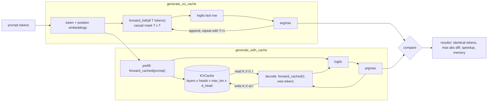

# ai-learn-15-kv-cache-inference

**Phase D, day 15** of the AI learning track. Real LLM serving depends on one trick: the **KV cache**. This repo builds a tiny decoder-only transformer in NumPy and generates text two ways. The first re-runs the whole prefix on every step. The second caches each layer's keys and values and feeds only the newest token. The smoke run checks that both produce the **same tokens** (and reports the max abs logit diff), then measures **speedup vs sequence length**, per-step latency and a **memory table**.

It builds on the attention (`ai-learn-01`), mini-transformer (`ai-learn-04`) and sampling (`ai-learn-05`) repos, but it is self-contained. NumPy + matplotlib only, no network, seed 42, about 5 s on CPU.

## What you'll learn

- Why autoregressive decoding without a cache does O(T²) work: every step recomputes K and V for tokens that have not changed.
- How to split inference into **prefill** (whole prompt at once) and **decode** (one token per step), and how the causal mask changes when queries are only the new rows.
- How to verify an optimisation: same greedy tokens, max abs logit diff at float32 rounding level.
- How KV memory scales (2·layers·heads·T·d_head·bytes per sequence), and why long contexts and big batches are limited by memory, not FLOPs.

## Architecture



## Layout

| path | purpose |
|---|---|
| `model.py` | `Config`, weights, `forward_full` (no cache), `KVCache`, `forward_cached` (prefill + decode) |
| `generate.py` | greedy `generate_no_cache` / `generate_with_cache` and `compare` (tokens, max abs diff, time, tokens fed) |
| `memory.py` | measured cache bytes vs the analytic formula, plus the no-cache attention-score footprint |
| `smoke_plots.py` | SVG plots + `RESULTS.md` writer |
| `run_smoke.py` | end-to-end smoke that writes `results/` |
| `notebooks/kv_cache_walkthrough.ipynb` | step-by-step walkthrough |
| `results/` | committed `RESULTS.md`, `metrics.json`, `JSON.shot`, `*.svg` |

## Run

```bash
python -m venv .venv && source .venv/bin/activate
pip install -r requirements.txt
python run_smoke.py
```

## Headline results (from `results/metrics.json`)

- Greedy tokens are **identical** with and without the cache at every length (16 to 256). The worst max abs logit diff is **7.6e-06**, which is float32 rounding.
- Speedup grows with length: **2.5x at 16 tokens, 12.5x at 128 and 29.1x at 256**. At 256 tokens the no-cache path feeds 32,612 tokens through the model and the cached path feeds 255.
- The KV cache costs **2,048 bytes per token** for this model (4 layers x 4 heads x 16 d_head x K,V x float32). The measured size matches the formula exactly. At 1,024 tokens the cache is 1.87x the size of the model weights.

Timings are wall-clock on a shared CPU and vary by run. The token/diff/memory numbers are deterministic.

## Limitations and next steps

The weights are random rather than trained (equivalence does not depend on them). Batch size is 1 with no paged or quantised cache. Natural follow-ups are multi-query / grouped-query attention (fewer KV heads), sliding-window caches, and cache quantisation.
