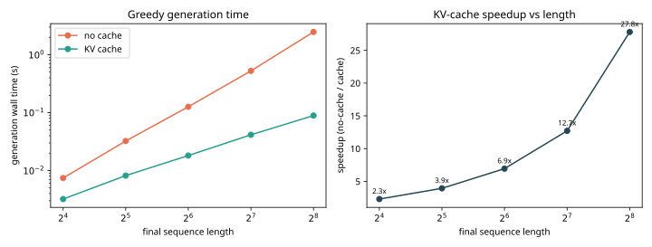
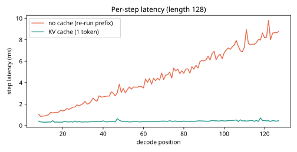
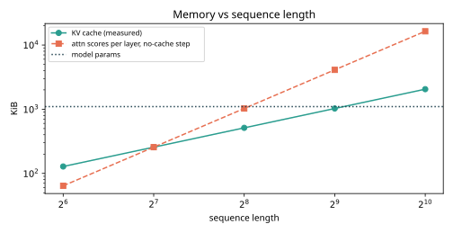

# Results -- ai-learn-15-kv-cache-inference

**Seed:** `42` | layers=4 heads=4 d_model=64 d_ff=256 vocab=128 | params=280,960 (1097.5 KiB float32) | prompt=8 tokens, greedy decoding

## Equivalence and speed (real smoke run)

| final len | new tokens | tokens identical | max abs logit diff | tokens fed (no cache) | tokens fed (cache) | no cache (s) | cache (s) | speedup |
|---:|---:|:---:|---:|---:|---:|---:|---:|---:|
| 16 | 8 | yes | 4.77e-06 | 92 | 15 | 0.0074 | 0.0032 | 2.31x |
| 32 | 24 | yes | 5.72e-06 | 468 | 31 | 0.0323 | 0.0082 | 3.95x |
| 64 | 56 | yes | 5.72e-06 | 1,988 | 63 | 0.1262 | 0.0182 | 6.94x |
| 128 | 120 | yes | 5.72e-06 | 8,100 | 127 | 0.5274 | 0.0415 | 12.72x |
| 256 | 248 | yes | 7.63e-06 | 32,612 | 255 | 2.4729 | 0.0889 | 27.80x |

All runs identical: **True**. Worst max abs logit diff: **7.63e-06** (float32 rounding: the two paths do the same math in a different order).

## Memory table

| seq len | KV cache bytes (measured) | formula 2·L·H·T·d_head·4 | match | bytes/token | KV / params | no-cache attn scores per layer (bytes) |
|---:|---:|---:|:---:|---:|---:|---:|
| 64 | 131,072 | 131,072 | yes | 2,048 | 0.117 | 65,536 |
| 128 | 262,144 | 262,144 | yes | 2,048 | 0.233 | 262,144 |
| 256 | 524,288 | 524,288 | yes | 2,048 | 0.467 | 1,048,576 |
| 512 | 1,048,576 | 1,048,576 | yes | 2,048 | 0.933 | 4,194,304 |
| 1024 | 2,097,152 | 2,097,152 | yes | 2,048 | 1.866 | 16,777,216 |

Same formula applied to a GPT-2-small-shaped model (12 layers, 12 heads, d_head 64, fp16, T=1024, batch=1): **36.0 MiB** of KV cache (analytic, not measured).

## Plots

Wall time: 4.46s on CPU.
